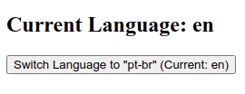
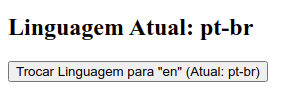
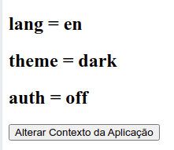
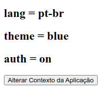

# Exercício acerca do *hook useContext*

Esse exercício deve ter início à partir do clone do repositório público do github disponibilizado em [alexpaulooliveira/reactjs_exerc__usecontext_start_point](https://github.com/alexpaulooliveira/reactjs_exerc__usecontext_start_point).

### Como baixar, configurar, e executar a aplicação:

Estando na pasta à partir da qual você deseja que a aplicação seja criada, execute o seguinte comando:

```
git clone <endereço do repositório>
```

Depois, instale as bibliotecas listadas no package.json, fazendo uso do seguinte comando:

```
npm install
```

Por fim, execute a aplicação fazendo uso do seguinte comando:


```
npm start
```

## Questões do exercício:

### 1) Cria uma aplicação para gerenciar a linguagem utilizada através do useContext, observando o seguinte: 

O sistema define (por padrão) a linguagem "en", como pode ser visto na imagem abaixo:



Quando o usuário clicar no botão "Switch Language...", a interface deve ser alterada... à semelhança do que pode ser visto na imagem abaixo:



Considere também que um novo clique no mesmo botão alterará o contexto novamente (conforme instruções exibidas no próprio botão)

### 2) Crie um aplicação que gerencie três variáveis em seu contexto (por meio do useContext).

A aplicação determinará (por padrão) os seguintes valores iniciais de contexto:



E, quando o usuário clicar no botão "Alterar Contexto da Aplicação" os valores do contexto devem ser alterados conforme imagem abaixo:



### 3) Para as duas aplicações criadas nas questões anteriores é possível perceber que o valor do contexto se perde quando um *refresh* é dado na página. Implemente uma solução para assegurar a persistência do contexto.
